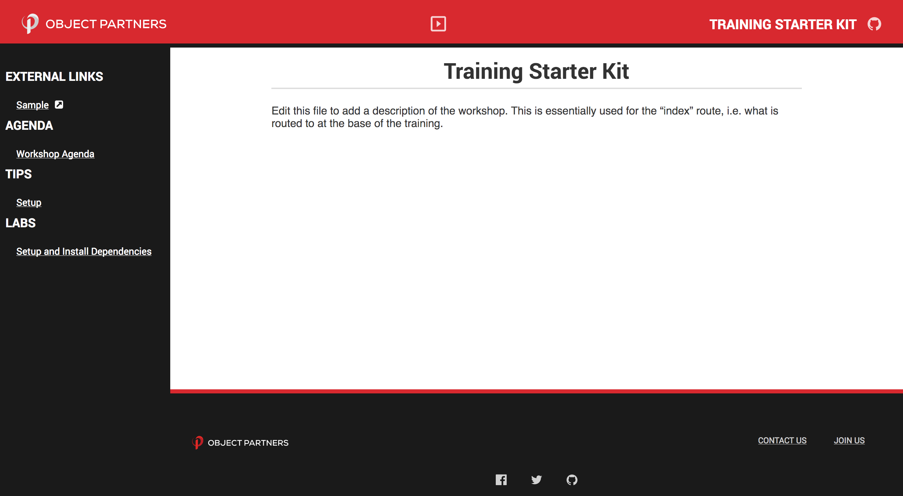

# workshop-starter-kit

A starter-kit/boilerplate for getting up and running quickly with a hosted version of workshop content powered by Markdown and Gatsby--a React static-site generator. For a complete example, check out the [react-redux-workshop][react-redux-workshop]



## Getting started

1. Clone (or fork) this repo `git clone git@github.com:objectpartners/workshop-starter-kit.git`
1. Run `yarn` or `npm install`--although `yarn` is recommended

### Commands

#### `yarn start` or `npm start`

This command will start a local live-reloading development server to preview the static/hosted content that will be created. Content can be edited/created and the server will reload to reflect the new changes. This will primarily be the command used to add and update content for the training course.

#### `yarn build` or `npm run build`

This command will build out the minified, optimized version of the static site. It will translate the React templates to statically generated HTML and can then be hosted with the static content host of your choice. [netlify][netlify] works quite well, but of course, whatever you choose to host the static content will work just fine.

## Usage

All content--primarily driven by Markdown and YAML--should be added in [content](./content).

For instance, let's walk through an example of adding a new lab.

### Adding a lab

To add a lab, simply add a file, e.g. `content/labs/01-getting-started.md`. Simply by adding this file, a link will appear in the sidebar and this file can be routed to and the Markdown content inside will be viewable in the site. Note: labs are sorted in folder sort order. For instance, `01-getting-started.md` will be before `02-whatever.md`, because the sort order is higher for `01-getting-started.md`.

#### Updating frontmatter

We use frontmatter, basically metadata exposed in `---` blocks to handle things like generating the title, url, etc. This can be extended with whatever metadata you please. Let's look at an example:

```md
---
title: Getting Started
---

Technology X is so great. Isn't it?!
```

### Updating meta tags

In order to handle SEO/social sharing, we use YAML to drive the meta tags. Simply update the meta key in [content/content.yaml](./content/content.yaml) to reflect the updated content.

### Adding external links

We have a special type of content, external links. These are links displayed in the sidebar that are not routed within the main application and will open in a new tab. They can be added within [content/content.yaml](./content/content.yaml), in particular in the links.external field.

### Removing Content

Don't need tips and tricks? Agenda? All can be adjusted fairly easily to fine tune your training content.

The first step is to simply delete the folder, i.e. `rm -rf content/tips-and-tricks`.

Next, we will need to augment our base query to remove this content type, which can be done in [`src/layouts/index.js`](./src/layouts/index.js).

Finally, we simply can remove the prop for that particular content type in that same layout file. Simply modify the file like so:

```jsx
<Sidebar
  labs={data.labs.edges}
  agendas={data.agendas.edges}
  links={data.links.edges}
/>
```

and voila, you now have a customized copy of the OPi training starter kit. Nice work!

## Deploying to Netlify

1. Create a new repo under the objectpartners group--consider making it public!
1. Go to [netlify][netlify] and add the repo
  - No settings need to be tweaked. [netlify.toml](./netlify.toml) is already in the root of this repo, and so the default settings can be used.
1. Watch the site deploy to your randomized domain
1. _Optionally_ consider creating a CNAME in Route53--ping a chief/director for more info--to re-direct to a top-level Object Partners domain, e.g. [react-training.objectpartners.com](https://react-training.objectpartners.com)

This will get you a free, statically hosted site with a friendly URL in front of it that can be easily shared to training attendees. 🎉

### Additional tips

- Consider creating a friendly domain name, i.e. react-redux-workshop.netlify.com in netlify's settings
- Consider turning on deploy previews on pull requests to get a staged deploy
  - On pull requests, a Netlify bot will build your site to a staged URL and add a pull request comment with the new URL
- If creating content for a client, turn on stage deploys and then push a new branch (i.e. `git checkout -b client-name && git push client-name`)
  - This will get you a persistent URL, i.e. client-name--your-netlify-deploy.netlify.com, that can be shared with clients for some duration after the workshop

[react-redux-workshop]: https://github.com/objectpartners/react-redux-workshop
[netlify]: https://netlify.com
